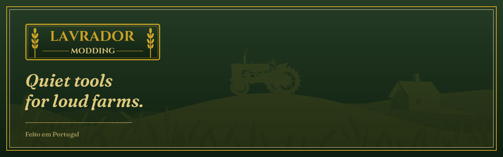

  

<em>Quiet tools for loud farms.</em>

---

I'm a solo Portuguese developer making focused Farming Simulator 25 script mods. Small tools that remove friction from the game: tracking, automation, UI polish. One problem each, done well. PC and Mac, singleplayer and multiplayer where it makes sense.

## Mods

- [Horse Advisor](https://github.com/lavrador-modding/FS25_HorseAdvisor) — sell your horses at the right time.
- [Horse Groomer](https://github.com/lavrador-modding/FS25_HorseGroomer) — pays a stable hand to ride and clean every horse, daily.

---

<em>Feito em Portugal 🇵🇹</em>
